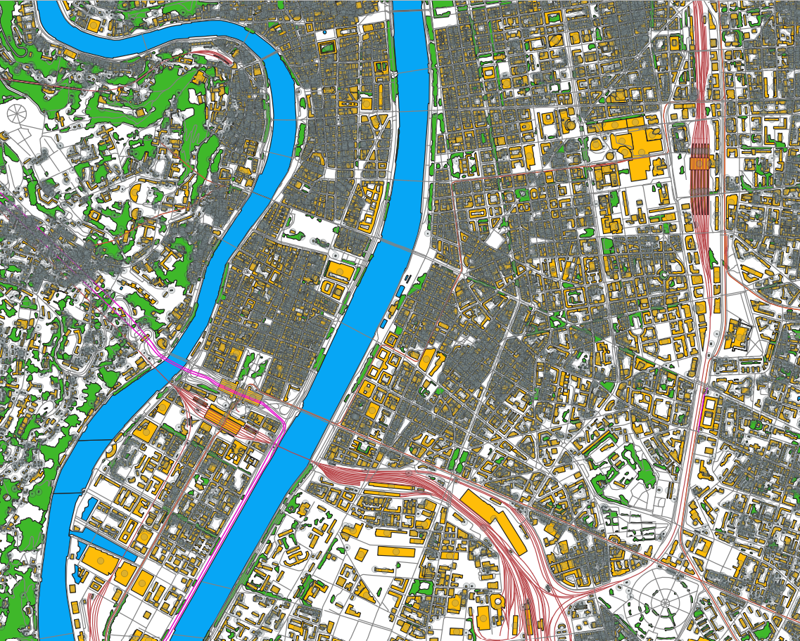

<div align="center">
    
    <h1>TIPE</h1>
    <h3>Tracing of paths for reconnaissance of an earthquake zone by drone</h3>
</div>

## 💻 Develop

This project is programmed in OCaml and uses opam and dune for building. Main commands are:

```bash
dune exec tipe    # Run the program quickly
dune build        # Build the program; output is in the _build directory
```

## 📜 Credits

- Materials used :
    - [Problème du voyageur de commerce euclidien](http://perso.eleves.ens-rennes.fr/people/clarence.kineider/DevsInfo/TSPE.pdf), Clarence Kineider
    - [Geometric Mesh Partitioning: Implementation and Experiments](https://www.cs.cmu.edu/~glmiller/Publications/GiMiTe98.pdf), John R. Gilbert, Gary L. Miller, Shang-Hua Teng

## 🔐 License

    DO WHAT THE FUCK YOU WANT TO PUBLIC LICENSE 
            Version 2, December 2004 

Copyright (C) 2004 Sam Hocevar <sam@hocevar.net> 

Everyone is permitted to copy and distribute verbatim or modified 
copies of this license document, and changing it is allowed as long 
as the name is changed. 

        DO WHAT THE FUCK YOU WANT TO PUBLIC LICENSE 
TERMS AND CONDITIONS FOR COPYING, DISTRIBUTION AND MODIFICATION 

0. You just DO WHAT THE FUCK YOU WANT TO.
